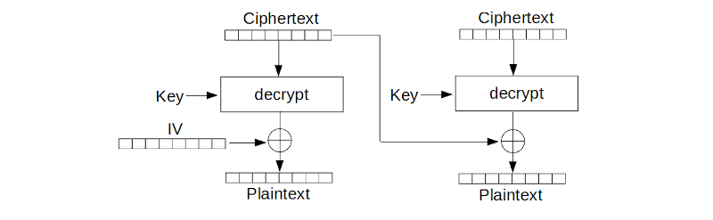
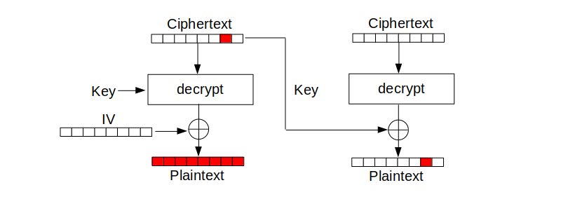
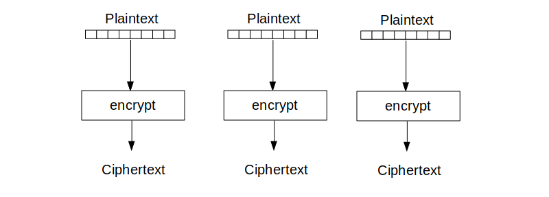
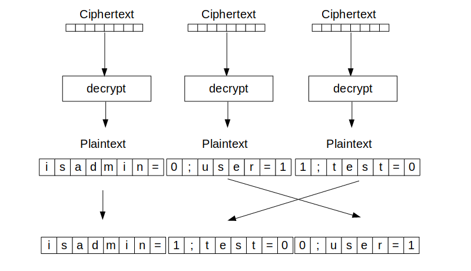
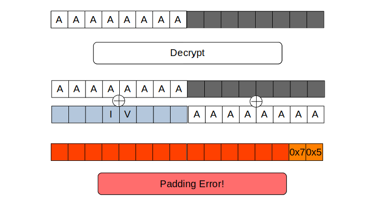
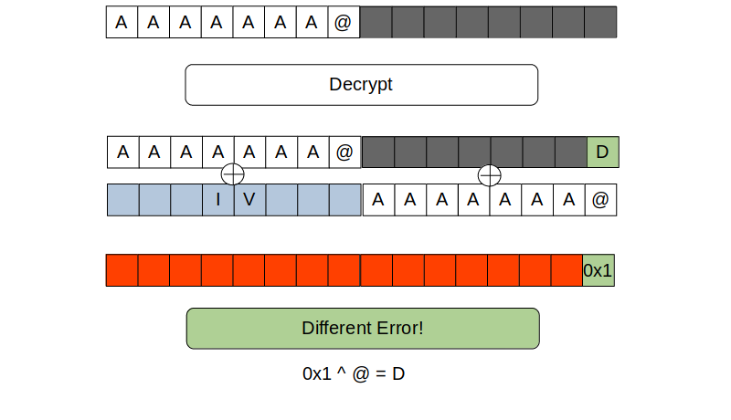

### crypted-cookie-monster

------

*crypted-cookie-monster (ccm)* is a command line utility and python library which assists identifying vulnerabilities around encrypted data.
Initially the tool was designed to test encrypted cookies, but it might also be useful in other situations. Currently, detection
of the following vulnerabilities is supported:

* [Bitflipping on CBC Ciphers](#bit-flipping)
* [Aimed Bitflipping on CBC Ciphers](#aimed-flipping)
* [Padding Oracle Vulnerabilities](#padding-oracle)
* [Block Shuffling on ECB Ciphers](#block-shuffling)

Providing an encrypted sample, *ccm* can assist you by creating wordlists, that could trigger an unwanted behavior inside of the application
that handles the encrypted data. Some example vulnerabilities can be found in the [Vulnerability Descriptions section](#vulnerability-descriptions).


### Installation

------

*ccm* can be build and installed as a *pip* package. The following
command installs *ccm* for your current user profile:

```console
$ pip3 install crypted-cookie-monster
```

You can also build *ccm* from source and install it directly by using
the following commands:

```console
$ git clone https://github.com/qtc-de/crypted-cookie-monster
$ cd crypted-cookie-monster
$ python3 setup.py sdist
$ pip3 install dist/*
```

Additionally, *ccm* ships a [bash-completion](./ccm/resources/bash_completion.d/ccm) script.
The completion script is installed automatically, but relies on the [completion-helpers](https://github.com/qtc-de/completion-helpers)
package. If *completion-helpers* is already installed, autocompletion for *ccm* should
work after installing the pip package. Otherwise, you may need to copy the completion
script manually:

```console
$ cp ccm/resources/bash_completion.d/ccm ~/.bash_completion.d
```


### Usage

------

In this section, the functionalities of the [ccm wrapper script](./bin/ccm) are explained in more detail. If you want to know
how *ccm* can be used as a python library, just check the source of the wrapper script (it is damn simple, really :D). 


#### Sample Info

When using *ccm* without any arguments, it displays information about the encrypted sample.

```console
[qtc@kali ~]$ ccm MJEAhaGscNcK6zj0Tj13pocV1q6x7IaVU0AdkJ8hnHZXEfXHpDTU8Pn8BIH7iVBZRzb8NEsA1BAyvxSNjjNJ1ygdjaNZzeUGSXn738oV17xhWt1WOYLeC2PFqRyXFZ4o
[+] Cookie Size: 96
[+] Possible block length: 8 	(12 blocks)
[+] Possible block length: 16 	(6 blocks)
```

Under normal circumstances, *ccm* can identify the cookie format automatically. Supported formats are: ``base64``, ``base64 url encoded``, ``base64 web safe`` and ``hex``.
The following examples will all use ``hex`` format, as it is easier to spot the applied transformations.

```console
[qtc@kali ~]$ ccm 30910085a1ac70d70aeb38f44e3d77a68715d6aeb1ec869553401d909f219c765711f5c7a434d4f0f9fc0481fb8950594736fc344b00d41032bf148d8e3349d7281d8da359cde5064979fbdfca15d700615add563982de0b63c5a91c97159e28
[+] Cookie Size: 96
[+] Possible block length: 8 	(12 blocks)
[+] Possible block length: 16 	(6 blocks)
```

Currently, only block sizes of ``8`` and ``16`` bytes are supported, but this should cover most cipher suites, as e.g. the *AES* default implementation only
allows a blocksize of ``16`` bytes. Theoretically, using larger block sizes should also be possible, but was not tested so far. If required, you can just
patch the code accordingly.

For some operations (*aimed flipping*, *block-shuffling*, *padding oracle*) the actual block size of the encrypted data play an important role. If
multiple block sizes are possible, *ccm* will always default to using both and outputs wordlists for ``8`` byte and ``16`` byte block sizes.
In situations where you are confident about the block size of the encrypted sample, you can specify the block size manually by using the ``--block-size``
option.


#### Bit Flipping

By using the parameter ``--bit-flip`` *ccm* will systematically flip single bits inside the provided sample and print the corresponding modified value:

```console
[qtc@kali ~]$ ccm --bit-flip 30910085a1ac70d70aeb38f44e3d77a68715d6aeb1ec869553401d909f219c765711f5c7a434d4f0f9fc0481fb8950594736fc344b00d41032bf148d8e3349d7281d8da359cde5064979fbdfca15d700615add563982de0b63c5a91c97159e28 | head
00910085a1ac70d70aeb38f44e3d77a68715d6aeb1ec869553401d909f219c765711f5c7a434d4f0f9fc0481fb8950594736fc344b00d41032bf148d8e3349d7281d8da359cde5064979fbdfca15d700615add563982de0b63c5a91c97159e28
01910085a1ac70d70aeb38f44e3d77a68715d6aeb1ec869553401d909f219c765711f5c7a434d4f0f9fc0481fb8950594736fc344b00d41032bf148d8e3349d7281d8da359cde5064979fbdfca15d700615add563982de0b63c5a91c97159e28
02910085a1ac70d70aeb38f44e3d77a68715d6aeb1ec869553401d909f219c765711f5c7a434d4f0f9fc0481fb8950594736fc344b00d41032bf148d8e3349d7281d8da359cde5064979fbdfca15d700615add563982de0b63c5a91c97159e28
03910085a1ac70d70aeb38f44e3d77a68715d6aeb1ec869553401d909f219c765711f5c7a434d4f0f9fc0481fb8950594736fc344b00d41032bf148d8e3349d7281d8da359cde5064979fbdfca15d700615add563982de0b63c5a91c97159e28
04910085a1ac70d70aeb38f44e3d77a68715d6aeb1ec869553401d909f219c765711f5c7a434d4f0f9fc0481fb8950594736fc344b00d41032bf148d8e3349d7281d8da359cde5064979fbdfca15d700615add563982de0b63c5a91c97159e28
05910085a1ac70d70aeb38f44e3d77a68715d6aeb1ec869553401d909f219c765711f5c7a434d4f0f9fc0481fb8950594736fc344b00d41032bf148d8e3349d7281d8da359cde5064979fbdfca15d700615add563982de0b63c5a91c97159e28
06910085a1ac70d70aeb38f44e3d77a68715d6aeb1ec869553401d909f219c765711f5c7a434d4f0f9fc0481fb8950594736fc344b00d41032bf148d8e3349d7281d8da359cde5064979fbdfca15d700615add563982de0b63c5a91c97159e28
07910085a1ac70d70aeb38f44e3d77a68715d6aeb1ec869553401d909f219c765711f5c7a434d4f0f9fc0481fb8950594736fc344b00d41032bf148d8e3349d7281d8da359cde5064979fbdfca15d700615add563982de0b63c5a91c97159e28
08910085a1ac70d70aeb38f44e3d77a68715d6aeb1ec869553401d909f219c765711f5c7a434d4f0f9fc0481fb8950594736fc344b00d41032bf148d8e3349d7281d8da359cde5064979fbdfca15d700615add563982de0b63c5a91c97159e28
09910085a1ac70d70aeb38f44e3d77a68715d6aeb1ec869553401d909f219c765711f5c7a434d4f0f9fc0481fb8950594736fc344b00d41032bf148d8e3349d7281d8da359cde5064979fbdfca15d700615add563982de0b63c5a91c97159e28
```

Using the ``--start-byte`` and ``--end-byte`` or ``--start-block`` and ``--end-block`` parameters, it is possible to control the area of the sample that is affected
by the flipping process. The specified numbers are interpreted as indices on the bytearray of the provided sample. Therefore, the option ``--end-byte 2`` stops after
modifying the third byte (index 2) of the sample. Furthermore, the maximum and minimum byte during flipping operations can be controlled via the ``--min-byte`` and ``--max-byte`` parameter.

```console
[qtc@kali ~]$ ccm --bit-flip --min-byte 5 --max-byte 7 --end-byte 2 30910085a1ac70d70aeb38f44e3d77a68715d6aeb1ec869553401d909f219c765711f5c7a434d4f0f9fc0481fb8950594736fc344b00d41032bf148d8e3349d7281d8da359cde5064979fbdfca15d700615add563982de0b63c5a91c97159e28
05910085a1ac70d70aeb38f44e3d77a68715d6aeb1ec869553401d909f219c765711f5c7a434d4f0f9fc0481fb8950594736fc344b00d41032bf148d8e3349d7281d8da359cde5064979fbdfca15d700615add563982de0b63c5a91c97159e28
06910085a1ac70d70aeb38f44e3d77a68715d6aeb1ec869553401d909f219c765711f5c7a434d4f0f9fc0481fb8950594736fc344b00d41032bf148d8e3349d7281d8da359cde5064979fbdfca15d700615add563982de0b63c5a91c97159e28
07910085a1ac70d70aeb38f44e3d77a68715d6aeb1ec869553401d909f219c765711f5c7a434d4f0f9fc0481fb8950594736fc344b00d41032bf148d8e3349d7281d8da359cde5064979fbdfca15d700615add563982de0b63c5a91c97159e28
30050085a1ac70d70aeb38f44e3d77a68715d6aeb1ec869553401d909f219c765711f5c7a434d4f0f9fc0481fb8950594736fc344b00d41032bf148d8e3349d7281d8da359cde5064979fbdfca15d700615add563982de0b63c5a91c97159e28
30060085a1ac70d70aeb38f44e3d77a68715d6aeb1ec869553401d909f219c765711f5c7a434d4f0f9fc0481fb8950594736fc344b00d41032bf148d8e3349d7281d8da359cde5064979fbdfca15d700615add563982de0b63c5a91c97159e28
30070085a1ac70d70aeb38f44e3d77a68715d6aeb1ec869553401d909f219c765711f5c7a434d4f0f9fc0481fb8950594736fc344b00d41032bf148d8e3349d7281d8da359cde5064979fbdfca15d700615add563982de0b63c5a91c97159e28
30910585a1ac70d70aeb38f44e3d77a68715d6aeb1ec869553401d909f219c765711f5c7a434d4f0f9fc0481fb8950594736fc344b00d41032bf148d8e3349d7281d8da359cde5064979fbdfca15d700615add563982de0b63c5a91c97159e28
30910685a1ac70d70aeb38f44e3d77a68715d6aeb1ec869553401d909f219c765711f5c7a434d4f0f9fc0481fb8950594736fc344b00d41032bf148d8e3349d7281d8da359cde5064979fbdfca15d700615add563982de0b63c5a91c97159e28
30910785a1ac70d70aeb38f44e3d77a68715d6aeb1ec869553401d909f219c765711f5c7a434d4f0f9fc0481fb8950594736fc344b00d41032bf148d8e3349d7281d8da359cde5064979fbdfca15d700615add563982de0b63c5a91c97159e28
```

#### Aimed Flipping

Instead of flipping single bits, the ``--aimed-flip`` option can be used to flip multiple bits in parallel. This can e.g. be used to flip a sequence like ``guest`` into
the sequence ``admin``. Of course, both sequences need to be of the same length and the targeted sequence needs to be fully contained inside a single block.

```console
[qtc@kali ~]$ ccm --aimed-flip guest admin 30910085a1ac70d70aeb38f44e3d77a68715d6aeb1ec869553401d909f219c765711f5c7a434d4f0f9fc0481fb8950594736fc344b00d41032bf148d8e3349d7281d8da359cde5064979fbdfca15d700615add563982de0b63c5a91c97159e28 | head
3680089fbbac70d70aeb38f44e3d77a68715d6aeb1ec869553401d909f219c765711f5c7a434d4f0f9fc0481fb8950594736fc344b00d41032bf148d8e3349d7281d8da359cde5064979fbdfca15d700615add563982de0b63c5a91c97159e28
3097118dbbb670d70aeb38f44e3d77a68715d6aeb1ec869553401d909f219c765711f5c7a434d4f0f9fc0481fb8950594736fc344b00d41032bf148d8e3349d7281d8da359cde5064979fbdfca15d700615add563982de0b63c5a91c97159e28
30910694a9b66ad70aeb38f44e3d77a68715d6aeb1ec869553401d909f219c765711f5c7a434d4f0f9fc0481fb8950594736fc344b00d41032bf148d8e3349d7281d8da359cde5064979fbdfca15d700615add563982de0b63c5a91c97159e28
30910083b0a46acd0aeb38f44e3d77a68715d6aeb1ec869553401d909f219c765711f5c7a434d4f0f9fc0481fb8950594736fc344b00d41032bf148d8e3349d7281d8da359cde5064979fbdfca15d700615add563982de0b63c5a91c97159e28
30910085a1ac70d70cfa30ee543d77a68715d6aeb1ec869553401d909f219c765711f5c7a434d4f0f9fc0481fb8950594736fc344b00d41032bf148d8e3349d7281d8da359cde5064979fbdfca15d700615add563982de0b63c5a91c97159e28
30910085a1ac70d70aed29fc542777a68715d6aeb1ec869553401d909f219c765711f5c7a434d4f0f9fc0481fb8950594736fc344b00d41032bf148d8e3349d7281d8da359cde5064979fbdfca15d700615add563982de0b63c5a91c97159e28
30910085a1ac70d70aeb3ee546276da68715d6aeb1ec869553401d909f219c765711f5c7a434d4f0f9fc0481fb8950594736fc344b00d41032bf148d8e3349d7281d8da359cde5064979fbdfca15d700615add563982de0b63c5a91c97159e28
30910085a1ac70d70aeb38f25f356dbc8715d6aeb1ec869553401d909f219c765711f5c7a434d4f0f9fc0481fb8950594736fc344b00d41032bf148d8e3349d7281d8da359cde5064979fbdfca15d700615add563982de0b63c5a91c97159e28
30910085a1ac70d70aeb38f44e3d77a68104deb4abec869553401d909f219c765711f5c7a434d4f0f9fc0481fb8950594736fc344b00d41032bf148d8e3349d7281d8da359cde5064979fbdfca15d700615add563982de0b63c5a91c97159e28
30910085a1ac70d70aeb38f44e3d77a68713c7a6abf6869553401d909f219c765711f5c7a434d4f0f9fc0481fb8950594736fc344b00d41032bf148d8e3349d7281d8da359cde5064979fbdfca15d700615add563982de0b63c5a91c97159e28
```

Again, modifying the affected area inside the sample is possible by using the ``--start-byte`` and ``--end-byte`` or the ``--start-block`` and ``--end-block`` options.
When not specifying a block size explicitly (via ``--block-size``) the resulting wordlist will cover both, the ``8`` byte and the ``16`` byte case.


#### Padding Oracle

*ccm* does not fully support *Padding Oracle Attacks*, but it can help you to identify *Padding Oracle Vulnerabilities*. By using the ``--padding`` option, *ccm* creates a
wordlist that systematically changes the value of the last byte inside the second last block. During decryption, this affects the padding of the decrypted data and
probably leads to a padding error (different error message than for correct padded data). Therefore, if the generated wordlist of ``256`` payloads leads to ``254``
(original padding != 0x01) or ``255`` (original padding == 0x01) times the same error message, but the other errors are different, the application is likely vulnerable.

```console
[qtc@kali ~]$ ccm --block-size 16 --padding 30910085a1ac70d70aeb38f44e3d77a68715d6aeb1ec869553401d909f219c765711f5c7a434d4f0f9fc0481fb8950594736fc344b00d41032bf148d8e3349d7281d8da359cde5064979fbdfca15d700615add563982de0b63c5a91c97159e28 | head
30910085a1ac70d70aeb38f44e3d77a68715d6aeb1ec869553401d909f219c765711f5c7a434d4f0f9fc0481fb8950594736fc344b00d41032bf148d8e3349d7281d8da359cde5064979fbdfca15d700615add563982de0b63c5a91c97159e28
30910085a1ac70d70aeb38f44e3d77a68715d6aeb1ec869553401d909f219c765711f5c7a434d4f0f9fc0481fb8950594736fc344b00d41032bf148d8e3349d7281d8da359cde5064979fbdfca15d701615add563982de0b63c5a91c97159e28
30910085a1ac70d70aeb38f44e3d77a68715d6aeb1ec869553401d909f219c765711f5c7a434d4f0f9fc0481fb8950594736fc344b00d41032bf148d8e3349d7281d8da359cde5064979fbdfca15d702615add563982de0b63c5a91c97159e28
30910085a1ac70d70aeb38f44e3d77a68715d6aeb1ec869553401d909f219c765711f5c7a434d4f0f9fc0481fb8950594736fc344b00d41032bf148d8e3349d7281d8da359cde5064979fbdfca15d703615add563982de0b63c5a91c97159e28
30910085a1ac70d70aeb38f44e3d77a68715d6aeb1ec869553401d909f219c765711f5c7a434d4f0f9fc0481fb8950594736fc344b00d41032bf148d8e3349d7281d8da359cde5064979fbdfca15d704615add563982de0b63c5a91c97159e28
30910085a1ac70d70aeb38f44e3d77a68715d6aeb1ec869553401d909f219c765711f5c7a434d4f0f9fc0481fb8950594736fc344b00d41032bf148d8e3349d7281d8da359cde5064979fbdfca15d705615add563982de0b63c5a91c97159e28
30910085a1ac70d70aeb38f44e3d77a68715d6aeb1ec869553401d909f219c765711f5c7a434d4f0f9fc0481fb8950594736fc344b00d41032bf148d8e3349d7281d8da359cde5064979fbdfca15d706615add563982de0b63c5a91c97159e28
30910085a1ac70d70aeb38f44e3d77a68715d6aeb1ec869553401d909f219c765711f5c7a434d4f0f9fc0481fb8950594736fc344b00d41032bf148d8e3349d7281d8da359cde5064979fbdfca15d707615add563982de0b63c5a91c97159e28
30910085a1ac70d70aeb38f44e3d77a68715d6aeb1ec869553401d909f219c765711f5c7a434d4f0f9fc0481fb8950594736fc344b00d41032bf148d8e3349d7281d8da359cde5064979fbdfca15d708615add563982de0b63c5a91c97159e28
30910085a1ac70d70aeb38f44e3d77a68715d6aeb1ec869553401d909f219c765711f5c7a434d4f0f9fc0481fb8950594736fc344b00d41032bf148d8e3349d7281d8da359cde5064979fbdfca15d709615add563982de0b63c5a91c97159e28
```


#### Block Shuffling

When using *ccm* with the ``--shuffle`` option, it switches the block position one at the time. Consider the original block structure is like
``ABCDEFG``, where each character represents an individual ``8`` or ``16`` byte block. *ccm* will now start at the first block and move it to
all other possible positions: ``BACDEFG``, ``BCADEFG``, ``BCDAEFG``, etc. After finishing with the first block, the same operation will be
repeated with the second block and so on.

```console
[qtc@kali ~]$ ccm --block-size 16 --shuffle 30910085a1ac70d70aeb38f44e3d77a68715d6aeb1ec869553401d909f219c765711f5c7a434d4f0f9fc0481fb8950594736fc344b00d41032bf148d8e3349d7281d8da359cde5064979fbdfca15d700615add563982de0b63c5a91c97159e28 | head
8715d6aeb1ec869553401d909f219c7630910085a1ac70d70aeb38f44e3d77a65711f5c7a434d4f0f9fc0481fb8950594736fc344b00d41032bf148d8e3349d7281d8da359cde5064979fbdfca15d700615add563982de0b63c5a91c97159e28
8715d6aeb1ec869553401d909f219c765711f5c7a434d4f0f9fc0481fb89505930910085a1ac70d70aeb38f44e3d77a64736fc344b00d41032bf148d8e3349d7281d8da359cde5064979fbdfca15d700615add563982de0b63c5a91c97159e28
8715d6aeb1ec869553401d909f219c765711f5c7a434d4f0f9fc0481fb8950594736fc344b00d41032bf148d8e3349d730910085a1ac70d70aeb38f44e3d77a6281d8da359cde5064979fbdfca15d700615add563982de0b63c5a91c97159e28
8715d6aeb1ec869553401d909f219c765711f5c7a434d4f0f9fc0481fb8950594736fc344b00d41032bf148d8e3349d7281d8da359cde5064979fbdfca15d70030910085a1ac70d70aeb38f44e3d77a6615add563982de0b63c5a91c97159e28
8715d6aeb1ec869553401d909f219c765711f5c7a434d4f0f9fc0481fb8950594736fc344b00d41032bf148d8e3349d7281d8da359cde5064979fbdfca15d700615add563982de0b63c5a91c97159e2830910085a1ac70d70aeb38f44e3d77a6
8715d6aeb1ec869553401d909f219c7630910085a1ac70d70aeb38f44e3d77a65711f5c7a434d4f0f9fc0481fb8950594736fc344b00d41032bf148d8e3349d7281d8da359cde5064979fbdfca15d700615add563982de0b63c5a91c97159e28
30910085a1ac70d70aeb38f44e3d77a65711f5c7a434d4f0f9fc0481fb8950598715d6aeb1ec869553401d909f219c764736fc344b00d41032bf148d8e3349d7281d8da359cde5064979fbdfca15d700615add563982de0b63c5a91c97159e28
30910085a1ac70d70aeb38f44e3d77a65711f5c7a434d4f0f9fc0481fb8950594736fc344b00d41032bf148d8e3349d78715d6aeb1ec869553401d909f219c76281d8da359cde5064979fbdfca15d700615add563982de0b63c5a91c97159e28
30910085a1ac70d70aeb38f44e3d77a65711f5c7a434d4f0f9fc0481fb8950594736fc344b00d41032bf148d8e3349d7281d8da359cde5064979fbdfca15d7008715d6aeb1ec869553401d909f219c76615add563982de0b63c5a91c97159e28
30910085a1ac70d70aeb38f44e3d77a65711f5c7a434d4f0f9fc0481fb8950594736fc344b00d41032bf148d8e3349d7281d8da359cde5064979fbdfca15d700615add563982de0b63c5a91c97159e288715d6aeb1ec869553401d909f219c76
```

You can also select only specific blocks that should be shuffled by using the ``--block`` option (can be used multiple times). Furthermore, the area where blocks are shuffled to can be controlled 
via ``--start-block`` and ``--end-block``.

```console
[qtc@kali ~]$ ccm --block-size 16 --shuffle --block 1 --block 2 30910085a1ac70d70aeb38f44e3d77a68715d6aeb1ec869553401d909f219c765711f5c7a434d4f0f9fc0481fb8950594736fc344b00d41032bf148d8e3349d7281d8da359cde5064979fbdfca15d700615add563982de0b63c5a91c97159e28 
8715d6aeb1ec869553401d909f219c7630910085a1ac70d70aeb38f44e3d77a65711f5c7a434d4f0f9fc0481fb8950594736fc344b00d41032bf148d8e3349d7281d8da359cde5064979fbdfca15d700615add563982de0b63c5a91c97159e28
30910085a1ac70d70aeb38f44e3d77a65711f5c7a434d4f0f9fc0481fb8950598715d6aeb1ec869553401d909f219c764736fc344b00d41032bf148d8e3349d7281d8da359cde5064979fbdfca15d700615add563982de0b63c5a91c97159e28
30910085a1ac70d70aeb38f44e3d77a65711f5c7a434d4f0f9fc0481fb8950594736fc344b00d41032bf148d8e3349d78715d6aeb1ec869553401d909f219c76281d8da359cde5064979fbdfca15d700615add563982de0b63c5a91c97159e28
30910085a1ac70d70aeb38f44e3d77a65711f5c7a434d4f0f9fc0481fb8950594736fc344b00d41032bf148d8e3349d7281d8da359cde5064979fbdfca15d7008715d6aeb1ec869553401d909f219c76615add563982de0b63c5a91c97159e28
30910085a1ac70d70aeb38f44e3d77a65711f5c7a434d4f0f9fc0481fb8950594736fc344b00d41032bf148d8e3349d7281d8da359cde5064979fbdfca15d700615add563982de0b63c5a91c97159e288715d6aeb1ec869553401d909f219c76
5711f5c7a434d4f0f9fc0481fb89505930910085a1ac70d70aeb38f44e3d77a68715d6aeb1ec869553401d909f219c764736fc344b00d41032bf148d8e3349d7281d8da359cde5064979fbdfca15d700615add563982de0b63c5a91c97159e28
30910085a1ac70d70aeb38f44e3d77a65711f5c7a434d4f0f9fc0481fb8950598715d6aeb1ec869553401d909f219c764736fc344b00d41032bf148d8e3349d7281d8da359cde5064979fbdfca15d700615add563982de0b63c5a91c97159e28
30910085a1ac70d70aeb38f44e3d77a68715d6aeb1ec869553401d909f219c764736fc344b00d41032bf148d8e3349d75711f5c7a434d4f0f9fc0481fb895059281d8da359cde5064979fbdfca15d700615add563982de0b63c5a91c97159e28
30910085a1ac70d70aeb38f44e3d77a68715d6aeb1ec869553401d909f219c764736fc344b00d41032bf148d8e3349d7281d8da359cde5064979fbdfca15d7005711f5c7a434d4f0f9fc0481fb895059615add563982de0b63c5a91c97159e28
30910085a1ac70d70aeb38f44e3d77a68715d6aeb1ec869553401d909f219c764736fc344b00d41032bf148d8e3349d7281d8da359cde5064979fbdfca15d700615add563982de0b63c5a91c97159e285711f5c7a434d4f0f9fc0481fb895059
```


#### Full Block Shuffling

In contrast to the ``--shuffle`` option, which only moves one block at the time, the ``--full-shuffle`` option returns all possible permutations of blocks contained inside the encrypted sample.

```console
[qtc@kali ~]$ ccm --block-size 16 --full-shuffle 30910085a1ac70d70aeb38f44e3d77a68715d6aeb1ec869553401d909f219c765711f5c7a434d4f0f9fc0481fb8950594736fc344b00d41032bf148d8e3349d7281d8da359cde5064979fbdfca15d700615add563982de0b63c5a91c97159e28 | head
30910085a1ac70d70aeb38f44e3d77a68715d6aeb1ec869553401d909f219c765711f5c7a434d4f0f9fc0481fb8950594736fc344b00d41032bf148d8e3349d7281d8da359cde5064979fbdfca15d700615add563982de0b63c5a91c97159e28
30910085a1ac70d70aeb38f44e3d77a68715d6aeb1ec869553401d909f219c765711f5c7a434d4f0f9fc0481fb8950594736fc344b00d41032bf148d8e3349d7615add563982de0b63c5a91c97159e28281d8da359cde5064979fbdfca15d700
30910085a1ac70d70aeb38f44e3d77a68715d6aeb1ec869553401d909f219c765711f5c7a434d4f0f9fc0481fb895059281d8da359cde5064979fbdfca15d7004736fc344b00d41032bf148d8e3349d7615add563982de0b63c5a91c97159e28
30910085a1ac70d70aeb38f44e3d77a68715d6aeb1ec869553401d909f219c765711f5c7a434d4f0f9fc0481fb895059281d8da359cde5064979fbdfca15d700615add563982de0b63c5a91c97159e284736fc344b00d41032bf148d8e3349d7
30910085a1ac70d70aeb38f44e3d77a68715d6aeb1ec869553401d909f219c765711f5c7a434d4f0f9fc0481fb895059615add563982de0b63c5a91c97159e284736fc344b00d41032bf148d8e3349d7281d8da359cde5064979fbdfca15d700
30910085a1ac70d70aeb38f44e3d77a68715d6aeb1ec869553401d909f219c765711f5c7a434d4f0f9fc0481fb895059615add563982de0b63c5a91c97159e28281d8da359cde5064979fbdfca15d7004736fc344b00d41032bf148d8e3349d7
30910085a1ac70d70aeb38f44e3d77a68715d6aeb1ec869553401d909f219c764736fc344b00d41032bf148d8e3349d75711f5c7a434d4f0f9fc0481fb895059281d8da359cde5064979fbdfca15d700615add563982de0b63c5a91c97159e28
30910085a1ac70d70aeb38f44e3d77a68715d6aeb1ec869553401d909f219c764736fc344b00d41032bf148d8e3349d75711f5c7a434d4f0f9fc0481fb895059615add563982de0b63c5a91c97159e28281d8da359cde5064979fbdfca15d700
30910085a1ac70d70aeb38f44e3d77a68715d6aeb1ec869553401d909f219c764736fc344b00d41032bf148d8e3349d7281d8da359cde5064979fbdfca15d7005711f5c7a434d4f0f9fc0481fb895059615add563982de0b63c5a91c97159e28
30910085a1ac70d70aeb38f44e3d77a68715d6aeb1ec869553401d909f219c764736fc344b00d41032bf148d8e3349d7281d8da359cde5064979fbdfca15d700615add563982de0b63c5a91c97159e285711f5c7a434d4f0f9fc0481fb895059
```

Using the ``--start-block`` and ``--end-block`` parameters, the permutation area can be controlled.

```console
[qtc@kali ~]$ ccm --block-size 16 --full-shuffle --start-block 1 --end-block 2 30910085a1ac70d70aeb38f44e3d77a68715d6aeb1ec869553401d909f219c765711f5c7a434d4f0f9fc0481fb8950594736fc344b00d41032bf148d8e3349d7281d8da359cde5064979fbdfca15d700615add563982de0b63c5a91c97159e28 
30910085a1ac70d70aeb38f44e3d77a68715d6aeb1ec869553401d909f219c765711f5c7a434d4f0f9fc0481fb8950594736fc344b00d41032bf148d8e3349d7281d8da359cde5064979fbdfca15d700615add563982de0b63c5a91c97159e28
30910085a1ac70d70aeb38f44e3d77a65711f5c7a434d4f0f9fc0481fb8950598715d6aeb1ec869553401d909f219c764736fc344b00d41032bf148d8e3349d7281d8da359cde5064979fbdfca15d700615add563982de0b63c5a91c97159e28
```


### Vulnerability Descriptions

------

There are many well written articles that describe the vulnerabilities that this tool tries to identify. In this section I just want to explain
the very basics of each vulnerability and help you to understand in which situations *ccm* could be useful.

1. **Bitflipping against CBC ciphers**
    
    *Cipher-Block-Chaining (CBC)* is a very popular encryption mode for block ciphers, that prevents remarkable patterns when encrypting similar portions of text.
    In contrast to the *Electronic Code Book Mode (ECB)*, different blocks influence each other, since previously generated ciphertext is *XORed* with plaintext before the encryption.

    

    Obviously, the decryption process has to implement the inverse operation to recover the original plaintext:

    

    One interisting point about CBC ciphers is that the *XOR* process allows deterministic changes on the actual plaintext by modifying the ciphertext.
    In the following example the second last byte inside the first ciphertext block is modified.

    

    Due to the nature of a good block cipher, this will completely destroy the actual plaintext that was contained inside the first block. However, on the second block
    the modified ciphertext does only cause a minimal change that is fully predictable for an attacker.

    During a *bitflipping* attack, each byte of the ciphertext is iterated over all possible values. As mentioned above, this procedure always invalidates one block of the actual plaintext, but 
    possibly leads to desirable effects on the following block. Common examples are flags like ``login=0``, which can easily be flipped into ``login=1`` using the *bitflipping* method.


2. **Aimed Bitflipping against CBC ciphers**


    While ordinary *bitflipping* can be sufficient to change a flag like ``login=0`` into ``login=1``, it will not allow more complex changes on the actual plaintext. 
    To allow more complex changes, it is required to flip more than one byte inside the ciphertext, which is just not a reasonable approach if done on a pure bruteforce basis.
    However, in cases where you have additional information about the encrypted data, even more complex changes become deterministically possible.

    As an example, consider you know that the encrypted plaintext contains the parameter ``admin=False``. In this case, it is easy to calculate the required changes on the ciphertext
    to turn the parameter into ``admin=True;``. 

        Ciphertext ⊕ Decrypt = 'False'
        Ciphertext ⊕ Decrypt ⊕ ('False' ⊕ 'True;') = 'False' ⊕ ('False' ⊕ 'True;')
        (Ciphertext ⊕ 'False' ⊕ 'True;') ⊕ Decrypt = 'True;'
        Ciphertext' ⊕ Decrypt = 'True;'

    In this particular case, the combination of five consecutive flips is required to achieve the desired result. These five flips can now be applied to all possible locations inside
    the encrypted ciphertext without creating an unmanageable large wordlist.

    One downside of *aimed bitflipping* is that the *current value* and the *desired value* of the targeted parameter have to be of the same length. In the above mentioned example it is unclear
    if the application handles the parameter ``admin=True;`` in the same way as it would handle the intended parameter value ``admin=True``.

3. **Block Shuffling against ECB ciphers**

    In contrast to *Cipher-Block-Chaining (CBC)* mode, when encrypting with *Electronic-Code-Book (ECB)* mode, different blocks do not influence each other. This is usually not desirable, since
    equal portions of plaintext are encrypted into the same ciphertext. The following graphic visualizes an encryption process in *ECB* mode: 

     

    The decryption process looks of course similar and this opens another interisting attack vector on *ECB* ciphers. Since all blocks are decrypted independent from each other, it is possible
    to rearrange the ordering of the different blocks while still keeping the original plaintext alive. Of course, the ordering of the different plaintext blocks will be different, but this may
    lead to desirable effects as demonstrated in the following graphic: 

    

4. **Padding Oracle**

    One obvious property of block ciphers is that they operate on a certain blocksize of data. E.g. in the graphics above, the blocksize was chosen to be 8 bytes and each plaintext/ciphertext
    block has to match exactly this size. But what happens when you want to encrypt data that does not match this blocksize? In this case, a padding procedure (usually *PKCS#7*) is applied. 
    The following graphic shows how an insufficiently long plaintext is padded to the required size: 

     

    As you can see, the padding procedure is quite simple. The missing number of bytes (*n*) is just appended to the plaintext, all with a value of *n*. During decryption, the cipher just needs to
    check for this kind of padding and needs to remove the last *n* bytes from the plaintext. However, there is one problem with plaintext that matches exactly a multiple of the blocksize. In this
    case no padding needs to be applied, but this needs to be known during decryption to not confound actual plaintext with padding values. To solve this issue, one also applies padding in these
    situations and append a full padded block to the plaintext.

    If encrypted data was incorrectly padded, there will be an error during the decryption process and this is exactly where you can find *Padding Oracle* vulnerabilities. If an application reacts
    differently to correctly and incorrectly padded data, and if this difference can be noticed by the enduser, it is possible to break the encryption. The following graphics show an example of this
    situation, where the goal is to decrypt an encrypted block of 8 bytes (displayed in grey). 

    

    In order to abuse the *Padding Oracle* the attacker prefixes the encrypted ciphertext with another block of random data. Since this block is *XORed* with the decrypted ciphertext, the resulting padding
    will most likely be wrong and does not match the *PKCS#7* specification. Since the application is vulnerable, it will return an error message that indicates the malformed padding.

    Now the last byte of the prefixed block is iterated over all possible values. For one certain value, the result of the *XOR* process will lead to a correct padding (0x01 at the end)
    and the application reacts with a different error message (Notice that there is the small probability that more than one value leads to a correct padding, but this should be really rare.)

    

    As shown in the picture above, it is now very simple to calculated the actual plaintext value. This can now be done byte per byte until the whole ciphertext is decrypted.


### Proof of Concept

----

*ccm* ships some test scripts that verify correct functionality of the library. Apart from more or less boring unit tests, there are also more practical tests for each of the above described attacks.
If you want to see any of the above described attack methods in action, check the [test_attacks.py](./tests/test_attacks.py) script.


### Some Final Remarks

------

The initial plan was to consume the *ccm* package directly from *BurpSuite's Turbo Intruder*, but unfortunately the official implementation of *Jython*
does not support *Python3* yet. Therefore, the small [ccm wrapper script](./bin/ccm) was written to easily generate some wordlists. If you want to consume
the functions from the *ccm* module directly, just look how the *ccm* script is interacting with the library.

*Copyright 2020, Tobias Neitzel and the crypted-cookie-monster contributors.*
